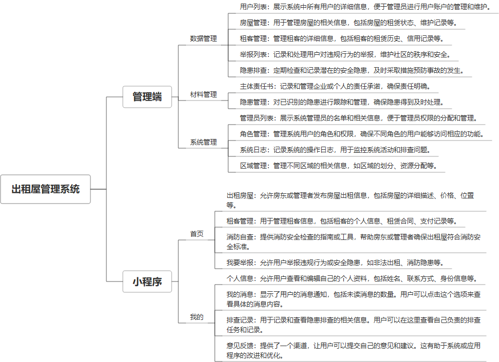

 

    
 

公司拥有上百套具有自主知识产权的软件系统，详情请查看码云首页或公司官网

 
<h1>出租屋管理系统</h1>

<a href="https://www.haishi.net.cn/">公司官网</a> ｜ <a href="https://www.haishi.net.cn/">在线体验</a>

 

## 系统介绍

"出租屋管理系统"是一个集房屋与租客管理、安全隐患排查、材料管理及区域管理等功能于一体的综合平台，支持WEB端和小程序端操作，旨在为管理者提供便捷高效的管理工具。
"出租屋管理系统"是一个集房屋与租客管理、安全隐患排查、材料管理及区域管理等功能于一体的综合平台，支持WEB端和小程序端操作，旨在为管理者提供便捷高效的管理工具。
本项目为出租屋管理系统，主要功能包括：登录系统、数据管理、材料管理、系统管理、小程序端功能介绍。其中，小程序端功能介绍包括：首页、房屋管理、租客管理、隐患管理、举报管理、个人中心。
                

## 系统功能介绍

### 系统包含终端说明

管理端（WEB）、用户端（微信小程序）

| 序号 | 模块 | 模块说明 |
| --- | --- | --- |
| 1 | ZF-CZWGL-GA-MP | 小程序 |
| 2 | ZF-CZWGL-GA-SERVER | 服务端 |

### 系统功能结构

### 系统功能说明

**登录系统**
- 登录
**数据管理**
- 用户列表
- 房屋管理
- 租客管理
- 举报列表
- 隐患排查
**材料管理**
- 主体责任书
- 隐患管理
**系统管理**
- 管理员列表
- 角色管理
- 系统日志
- 区域管理
**小程序端功能介绍**
- 首页
- 房屋管理
- 租客管理
- 隐患管理
- 举报管理
- 个人中心
- 登录
- 个人信息
- 我的消息
- 排查记录

## 系统主要界面

## 系统技术说明

### 代码模块说明

| 序号 | 目录 | 目录说明 |
| --- | --- | --- |
| 1 | ZF-CZWGL-GA-SERVER/house-common | -- |
| 2 | ZF-CZWGL-GA-SERVER/house-api | -- |
| 3 | ZF-CZWGL-GA-SERVER/house-admin | -- |
| 4 | ZF-CZWGL-GA-SERVER/.idea | -- |

### 系统技术选型

#### 开发语言/框架

JAVA（JDK1.8）
前端框架：VUE2
系统结构：单体应用
框架：SpringBoot2.x

#### 服务中间件

Tomcat

#### 数据库

MySQL（5.7+）
Redis

#### 其他说明

无

## 系统演示/商用

请扫码添加客服微信获取演示地址和系统详细资料。

如果您想基于出租屋管理系统进行商业化交付或定制开发服务，我们提供有偿的技术服务支持，合作模式不限，欢迎沟通！

公司官网地址： <a href="https://www.haishi.net.cn/">https://www.haishi.net.cn</a>

联系客服获取专业回答。

## 使用须知

1、 本项目商用必须获得版权所有者的授权。

2、 未经允许本项目代码不允许二次出售。

